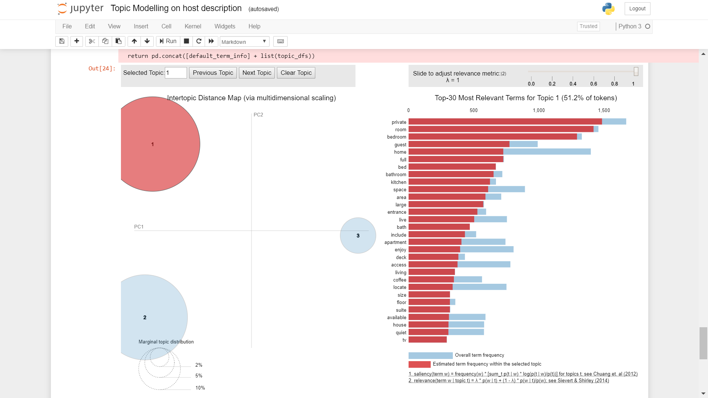

# Topic-Modelling-on-Airbnb-reviews
Incoprating insights from text data by performing topic modelling on host description and customer reviews.

Data used : Ashville Airbnb 
Data: http://insideairbnb.com/get-the-data.html
Solution : Performed LDA analysis on host description
Clustering Airbnb Hosts based on their description

The area of circle represent the prevalence of each topic while the length of the bars on the right represent the membership of a term in a particular topic

For Example topic1 has terms like 'private', 'large', 'space', 'area' which indicates this cluster of hosts give importance to 'Luxury'.

Topic 2 has terms like 'downtown', 'resturant', 'minute' which indicates this cluster of hosts give importance to 'Location'.

Topic 3 has terms like 'nature', 'cabin', 'view' which shows this cluster of hosts are "Nature Lovers".

